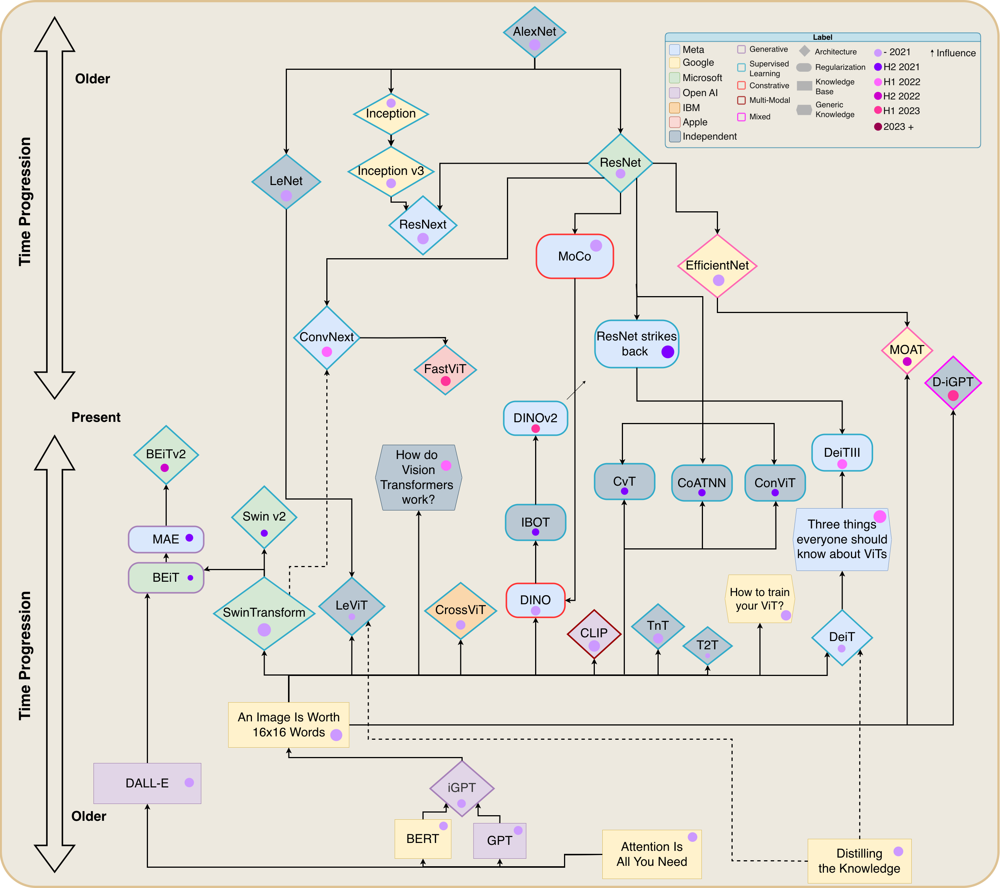

# Decoding Vision Transformer Variations for Image Classification



**João Montrezol, Hugo S. Oliveira, Hélder P. Oliveira**  
*Machine Learning with Applications, Volume 23, March 2026, 100844*  
📄 DOI: 10.1016/j.mlwa.2026.100844

---

## 📖 Overview

This repository accompanies the study **“Decoding Vision Transformer Variations for Image Classification”**, which provides a systematic analysis of the rapidly expanding ecosystem of **Vision Transformer (ViT)** architectures.

Since their introduction, ViTs have emerged as a powerful alternative to convolutional neural networks (CNNs). However, the diversity of architectural variants—ranging from pure transformers to hybrid CNN–ViT models—has made it increasingly difficult to understand their relative strengths, limitations, and practical usability.

This work addresses that gap by offering a **structured taxonomy, benchmarking framework, and comparative analysis** of ViT-based models across multiple dimensions.

---

## ✨ Key Contributions

- **Comprehensive Taxonomy of ViT Architectures**  
  A clear categorisation of pure transformer models, hybrid CNN–ViT architectures, and traditional CNN baselines.

- **Systematic Benchmarking Study**  
  Extensive empirical comparison focusing on accuracy, computational complexity, and architectural trade-offs.

- **Performance vs. Usability Analysis**  
  Highlights how design choices impact training stability, inference cost, and deployment feasibility.

- **Practical Guidelines for Model Selection**  
  Provides actionable insights to help researchers and practitioners select architectures best suited to their tasks and constraints.

---

## 🧠 Method Overview

The proposed analysis framework evaluates a broad spectrum of image classification models by:

- Benchmarking **pure ViT architectures**  
- Analysing **hybrid CNN–Transformer designs**  
- Comparing against **traditional CNN baselines**  

All models are evaluated under consistent training and evaluation protocols, enabling fair comparisons across architectural paradigms. The study focuses on understanding how **model complexity, attention mechanisms, and convolutional inductive biases** influence performance and efficiency.

---

## 📊 Results & Architectural Insights

The benchmarking results reveal clear trade-offs between:

- Classification performance  
- Computational cost (parameters, FLOPs)  
- Architectural complexity and scalability  

These findings provide deeper insight into when and why specific ViT variants outperform others, particularly in resource-constrained or data-limited settings.

---

## 🔑 Keywords

- Vision Transformers  
- Transformer Architectures  
- Image Classification  
- Computational Complexity  

---

## 🛠 Usage & Dependencies

Install the required Python dependencies using:

```bash
pip install -r requirements.txt


## 📦 Model Weights & Checkpoints

All pre-trained weights and checkpoints for the evaluated models—including **CNNs, pure ViTs, and hybrid CNN–ViT architectures**—are publicly available.

- **Download all weights:** [Google Drive Folder](https://drive.google.com/drive/folders/1rJ8rSHNXU3y4IqndCBFuM8-JCU-Bo4we?usp=sharing)  

The folder is **organised by model type** and includes configuration files to ensure full **experimental reproducibility**.
